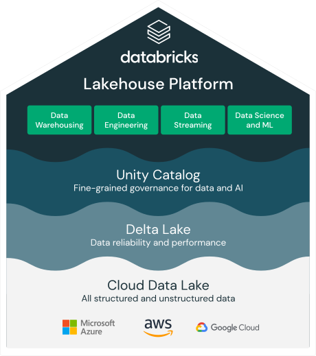

### FRANCISCO JAIME DA SILVA

## Projeto Engenharia de dados com DataBriks

__*Foi Crianda uma estrutura de data lake no Databriks community*__

O projeto consiste em criar um data lake no Databriks community, fazer upload de dados processa-lo e converte-los para um formato mais adequado a analises levando em consideração espaço de armazenamento e performance do pyspark. 

---

### Etapas do Projeto

1. 1. Foi Criado um datalake  utilizando o Min.io intalado localmente com estruta abaixo
<ul>
  <li>Bancket(landing) - Landing zone ou Zona de Pouso(dados em formato bruto)</li>
  <li>Bancket(processing) - Processing zone(dados pre-processados)</li>
  <li>Bancket(cureted) - Cureted zone(Dados limpos, agregados e prontos para análises)</li>  
</ul> 
2.Foi realizado o upload dos arquivos de dados na zona de pouso(landing), extraídos do kaggle

<ul>
  <li>T201601PDPI+BNFT.csv</li>
  <li>T201602PDPI+BNFT.csv</li>
  <li>T201603PDPI+BNFT.csv</li>
  <li>T201604PDPI+BNFT.csv</li> 
  <li>T201605PDPI+BNFT.csv</li>  
  <li>T201606PDPI+BNFT.csv</li>
  <li>T201607PDPI+BNFT.csv</li>
  <li>T201608PDPI+BNFT.csv</li>
  <li>T201609PDPI+BNFT.csv</li>
  <li>T201610PDPI+BNFT.csv</li>
  <li>T201611PDPI+BNFT.csv</li>
  <li>T201612PDPI+BNFT.csv</li>   
</ul> 

3. Foram realizadas a limpeza, preprocessamento e conversão para o formato parquet, visando melhorar a performance nas proximas etapas do processo. O resultado(df-formatado.parquet) desse processo foi gravado na Proessin zone.

4. Foi realiada a leitura dos dado em formato parquet e criada a view Dados_Sql para permitir exploração dos dados via SQL.
5. Foi aplicada agragação nos dados da view Dados_Sql e gravados o resultado na Cureted zone em formato parquet.(df-Dados-Agregados.parquet)

5. Foi utiizado o notebook abaixo para realiza o processamento dos dados.
<>

